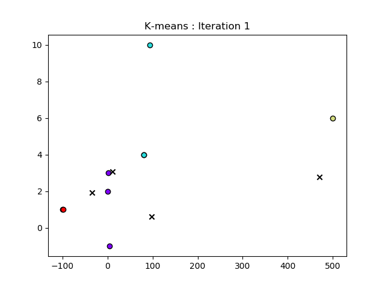
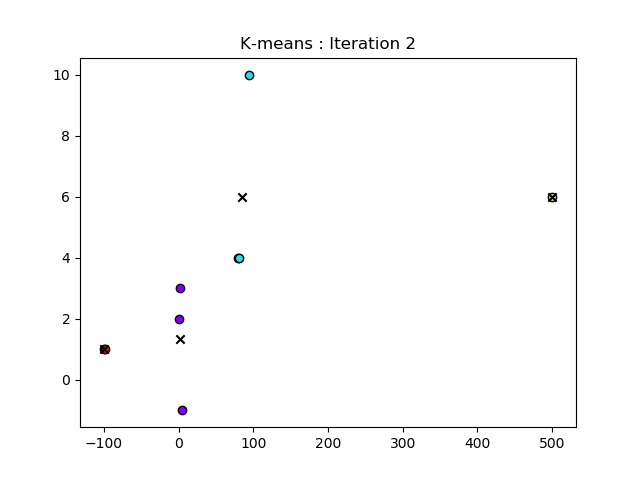

# K-means-Algorithm
This is a repository to display my own personally built K-means algorithm!  The **K-means.py** file in this repository contains functions that go through the mathimatics and plots of the steps for the K-means machine learning algorithm. 

These steps include:

1. Setting the initial randomized coordinates for a predefined k number of centroids

2. Assigning the available points to their closest random centroid point

3. Reassigning the coordinates of the centroids based on the mean of the coordinates for the points each are assigned  

The second and third step of this process is repeated until the centroid coordinates are no longer changing, signifying that the algorithm has arrived to it's conclusion on its assignments for the k clusters.

